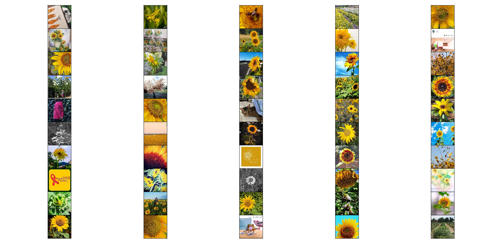
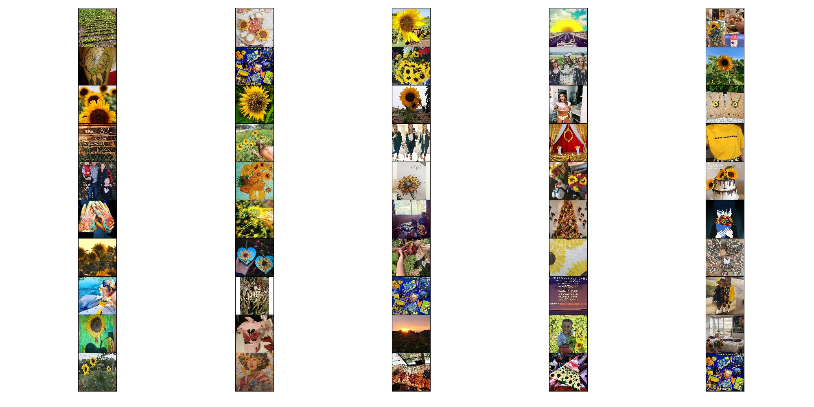

[English](README_en.md)
# MMAI-synset

图像标签组成的多模态同义词集数据集

## 说明

多模态同义词集数据是建立在[1]基础上构建的，我们扩展了伊利诺伊大学香槟分校收集的Wikipedia文本同义词集数据集[1]，使其变为多模态同义词集数据。 具体的，我们使用Wikipedia数据集中的所有名词短语，利用爬虫手段从Instagram社交媒体网站上爬取其对应的图像。 我们将图像集合与文本标签作为多模态同义词集数据的一个实例，每个实例包含50张图片与1一个文本短语标签。 

通过上述方法，我们获得了8,509个文本短语标签及其相应的425,450个图像。同时我们按照基于[1]中数据划分方式，将整个数据集分为训练集和测试集。训练集包含7,833个实例，而测试集包含676个实例。 该数据集包含用于训练的3,911个同义词集和用于测试的209个同义词集。 下面表显示了MMAI-Synset的统计信息。

No.| Characteristics |Quantity
---|---|---
1 | # Noun Phrases| 8,509
2 | # Images| 425,450
3 | # Instances for Training| 7833
4 | # Instances for Testing | 676
5 | # Synonyms for Training |3911
6 | # Synonyms for Testing |209

## 示例
- helianthusannuus

- sunflowers

## 下载
我们将会尽快发布整个数据集。

我们先发布了本文使用到的文本同义词集数据集,`text_synset`。

## 其他
如果你有什么需要帮助，请在发送邮件至`peter_chen_jaon@foxmail.com`

## 引用
1. Shen J, Lyu R, Ren X, et al. Mining Entity Synonyms with Efficient Neural Set Generation[C]//Proceedings of the AAAI Conference on Artificial Intelligence. 2019, 33: 249-256.
2. https://github.com/mickeystroller/SynSetMine-pytorch

