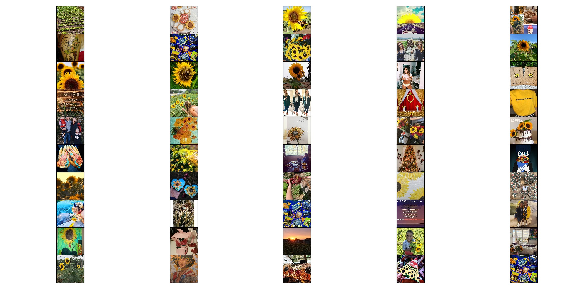

[中文版](README.md)
# MMAI-synset
The multimodal synset dataset for image and tag.

## Instruction
Multimodal synset data is built on the basis of [1]. We introduce the visual information to expand the Wikipedia text synset dataset [1] collected by the University of Illinois at Urbana-Champaign to become multimodal synset data. Specifically, we use the noun phrases in the text synset dataset and adopt crawlers to crawl their corresponding images from Instagram. We use image collections and text labels as an instance of the multimodal synset dataset. Each instance contains 50 images and a text label.

Through the above method, we obtain 8,509 text phrase labels and their corresponding 425,450 images. At the same time, we divide the entire data set into a training set and a testing set according to the data division method based on [1]. The training set contains 7,833 instances, while the testing set contains 676 instances. The data set contains 3,911 synsets for training and 209 synsets for testing. The following table shows the statistical information on MMAI-Synset.

No.| Characteristics |Quantity
---|---|---
1 | # Noun Phrases| 8,509
2 | # Images| 425,450
3 | # Instances for Training| 7833
4 | # Instances for Testing | 676
5 | # Synonyms for Training |3911
6 | # Synonyms for Testing |209

## Demo
- helianthusannuus

- sunflowers

## Download
The text synset dataset used in this article, `text_synset`, corresponds to the image data `visual_synset`, please follow the steps below to download:

1. At present, we have released the data set to the Internet. For researchers who need to use it, please send the name, unit and purpose information to `peter_chen_jaon@foxmail.com, and we will return the download address of the data set.

2. After downloading, execute the following command `cat mmai-synset/* | tar -zxvf` to decompress

## Others
If you need help, please send an email to `peter_chen_jaon@foxmail.com`

## Reference
1. Shen J, Lyu R, Ren X, et al. Mining Entity Synonyms with Efficient Neural Set Generation[C]//Proceedings of the AAAI Conference on Artificial Intelligence. 2019, 33: 249-256.
2. https://github.com/mickeystroller/SynSetMine-pytorch

# TrimSyn

We release the TrimSyn repo which levarage the multimodal information to induce synsets.
